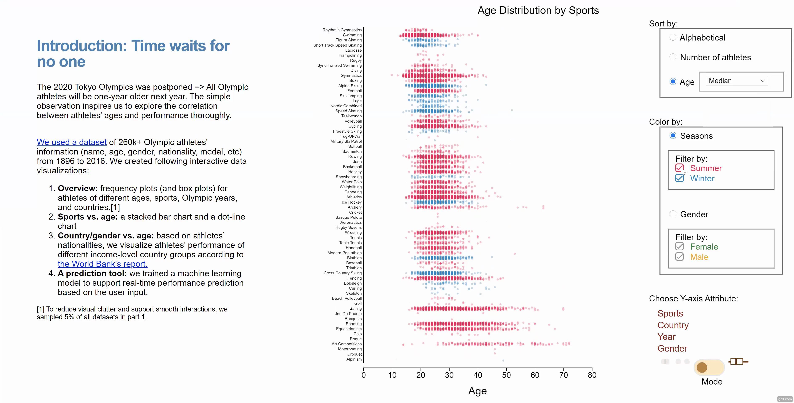
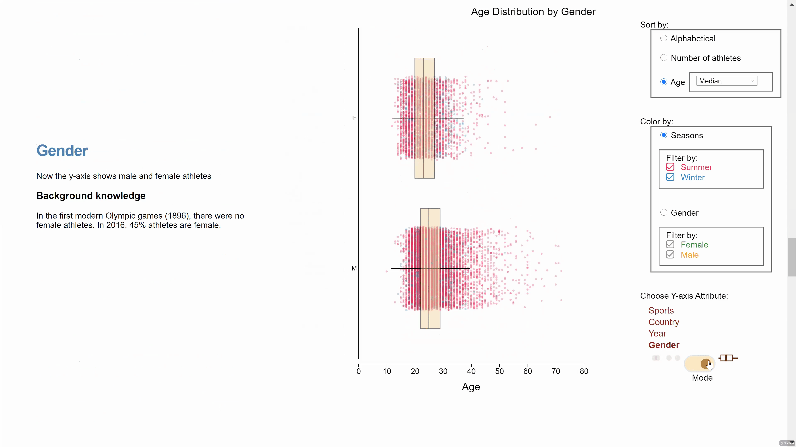
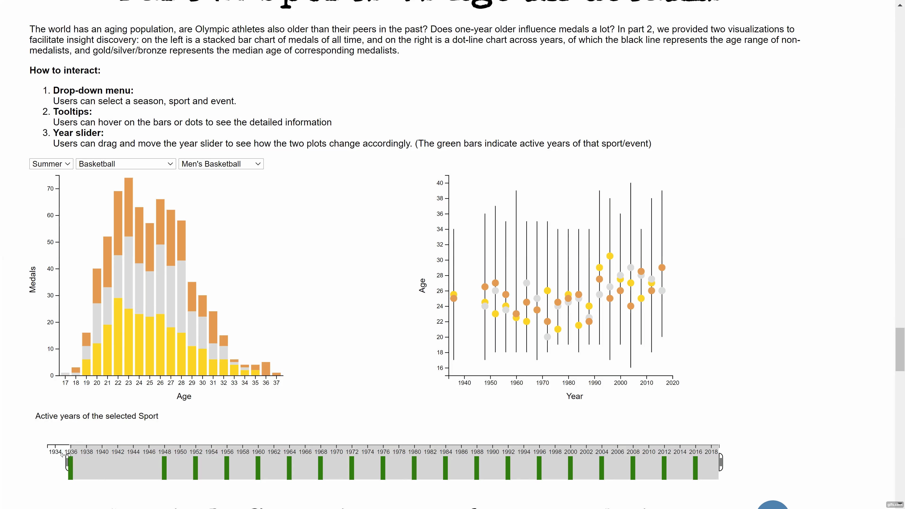
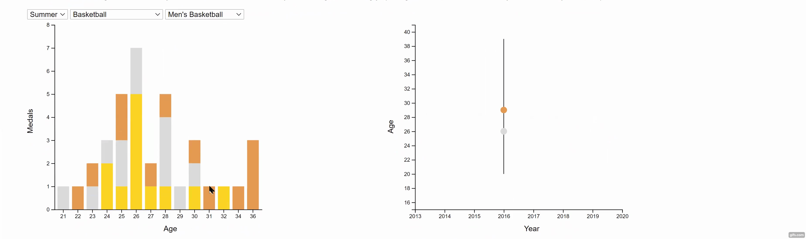
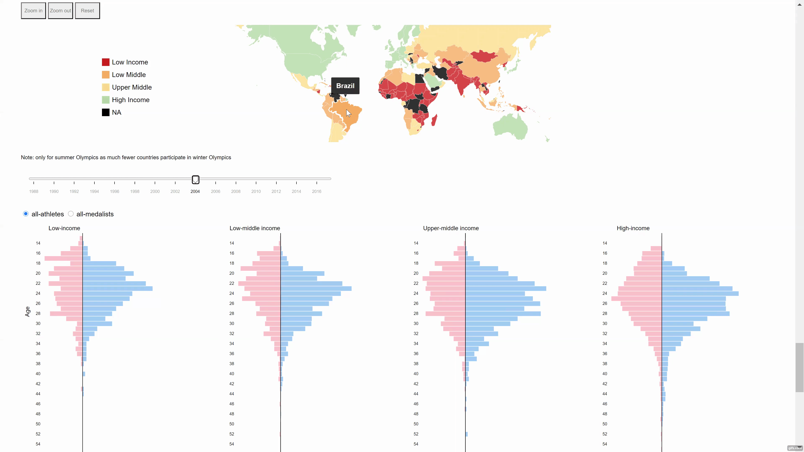
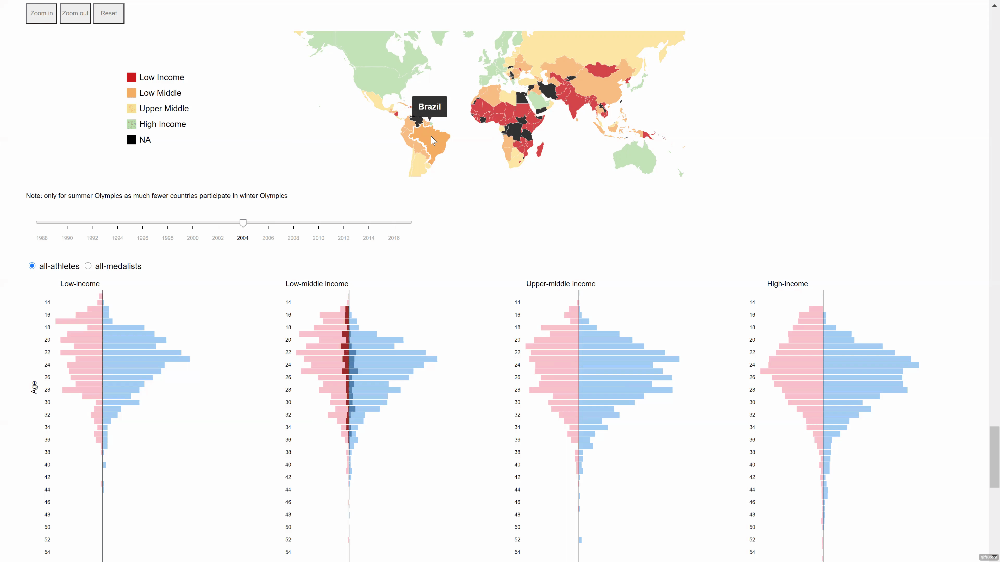
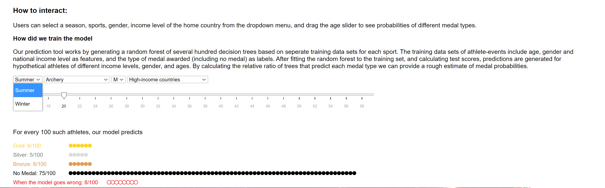
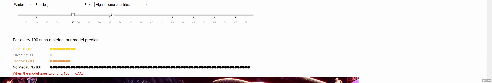
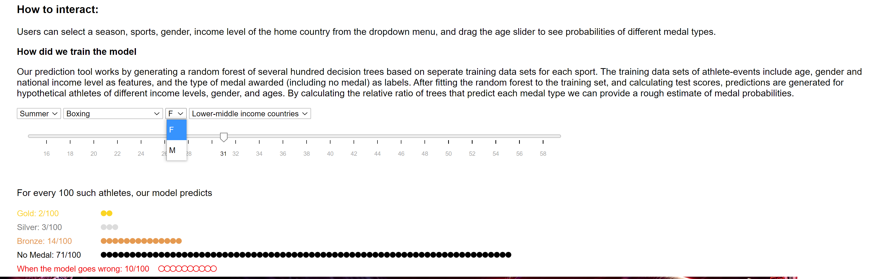

# Time Waits for No One: How Olympic Athletes’ Ages Correlate with Performance
.gif)

Try Our 
**Website:** https://olympicvis.github.io/
------
## Running the code locally
1. Run `cd OlympicVis.github.io`.
2. Run `python -m http.server 8080` (for python 3).
3. open a browser tab to localhost:8080.

## Part 1: A Overview of Athletes' Ages
How to interact:
1. __Sort by__: sort the frequency plot by age, number of athletes or the alphabetical order

   a. Sort by number of athletes

   b. Sort by age(minimum & maximum value)

3. __Change seasons__: data can be further filtered to show summer or winter season 

4. __Change y-axis__: the data could be aggregated by sports, country, year and gender

   a. Aggregate by country

   b. Aggregate by year

   c. Aggregate by Gender and change the mode toggle to show the density plot or the box plot

## Part 2: Sports vs Age in details
How to interact:
1. __Drop-down menu__: Users can select a season, sport and event

   a. Select Season
   

   b. Select sport from dropdown
   
2. __Year slider__: Users can drag and move the year slider to see how the two plots change accordingly. (The green bars indicate active years of that sport/event)
     
3. __Tooltips__: Users can hover on the bars or dots to see the detailed information
   

## Part 3: Country vs Age in details 
How to interact:
1. __The map__: Users can hover on the map to see country names, and also zoom and pan.
Users can click a country on the map, and the tornado chart will change to reflect the selected country in darker colors.

   a. Hover over the map to see country name
   
   b. Click a country on the map, and the tornado chart will change to reflect the selected country in darker colors by using the income data provided.
   
   c. Filter the tornado plot based all athletes or only medalist
   
   
## Part 4: the prediction
How to interact:
1. Users can select a season, sports, gender, income level of the home country from the dropdown menu, and drag the age slider to see probabilities of different medal types
   
   
   

